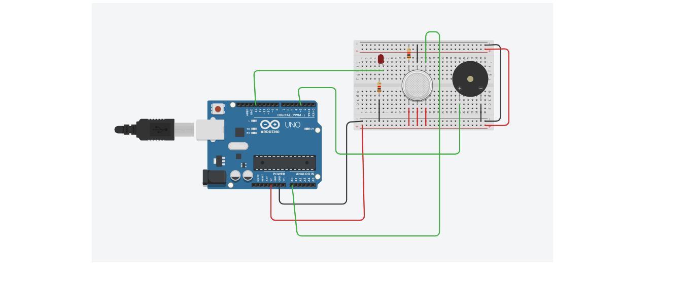
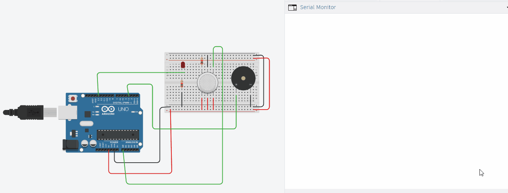

# Gas Sensor Alarm System using Arduino Uno

A safety system that uses an MQ-2 gas sensor to detect LPG, smoke, methane, and other combustible gases. When gas concentration exceeds the threshold, an LED turns ON and a buzzer sounds an alarm.

### **Circuit Diagram**

### **How It Works**
The MQ-2 gas sensor outputs an analog voltage proportional to gas concentration.

1. Arduino reads the analog value from the MQ-2 sensor connected to A0 using `analogRead()`
2. The raw ADC value ranges from 0-1023, representing 0-5V
3. If the sensor value is `>= 150`, it indicates dangerous gas levels
4. Arduino turns ON the LED on pin D13 and generates a 1kHz tone on buzzer pin D3
5. If gas level is safe `< 150`, LED and buzzer stay OFF
6. Values are printed to Serial Monitor for real-time monitoring

This demonstrates ADC, sensor interfacing, and threshold-based alarm systems.

### **Demo**

 **Note**: GIF shows Tinkercad simulation. When gas is introduced, sensor value crosses 150 → LED turns ON and buzzer sounds. GIF has no audio.

### **Components Required**
| Component | Quantity |
| --- | --- |
| Arduino Uno R3 | 1 |
| MQ-2 Gas Sensor | 1 |
| Red LED | 1 |
| 220Ω Resistor | 1 |
| Piezo Buzzer | 1 |
| Breadboard + Jumper Wires | - |

### **Circuit Connections**
| Component | Arduino Pin |
| --- | --- |
| MQ-2 VCC | 5V |
| MQ-2 GND | GND |
| MQ-2 A0 | A0 |
| LED + | D13 via 220Ω |
| LED - | GND |
| Buzzer + | D3 |
| Buzzer - | GND |

### **Code**
File: `interfacing_gas_sensor_with_arduino1.ino`

### **How to Use**
1. Clone or download this repository.
2. Open Gas_Sensor_Alarm.ino in Arduino IDE.
3. Build the circuit as per the diagram.
4. Select Board: Arduino Uno and correct COM PortClick.
5. UploadOpen Serial Monitor at 9600 baud.
6. The MQ-2 sensor needs 20-30 seconds preheat time after power-on.
7. Introduce gas/lighter near sensor to see values increase and alarm trigger.

### **Key Concepts Learned**
1. Analog Sensors: MQ-2 outputs variable voltage based on gas concentration
2. ADC Thresholding: Using if(sensorvalue >= 150) to trigger actions.
3. Gas Sensor Calibration: Threshold 150 is for demo. Real projects need calibration with known gas standards.
4. **Safety Systems:** Combining visual LED + audible buzzer for alerts.
5. **Serial Monitoring:** Debugging sensor values in real-time using Serial.println()
6. **tone() Function:** Generating audio frequencies for buzzer alarms

### **Important Safety Notes**
1. **Calibration Required:** The threshold 150 is for Tinkercad/demo only. For real use, calibrate with proper gas standards.
2. **Preheat Time:** MQ-2 needs ∼20 seconds to heat up before giving stable readings.
3. **Not for Life Safety:** This is an educational project. Do not use for actual life-critical gas leak detection without certification.
4. **Ventilation:** Test with small gas amounts in ventilated area only.
